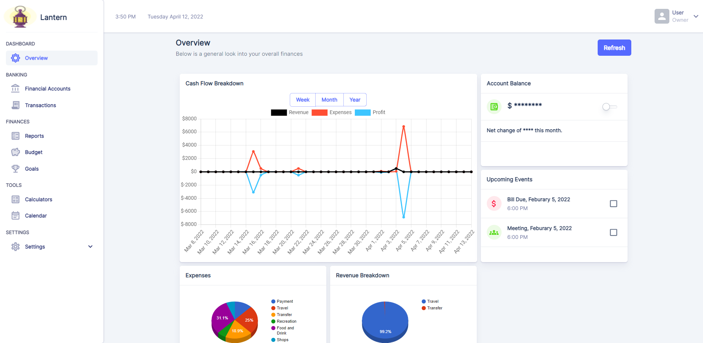

    <h1>
        
    </h1>

# Lantern

Lantern is a free, open source web-application that gives small businesses the ability to track and account for all income and cash flow along with providing computed detailed reports and finanical analysis.

Lantern is in continous development with new features and bug fixes giving all devlopers the opportunity to contribute!

    <h1>
        
    </h1>

# Features
<ul>
  <li>Net Cash Flow Statment</li>
  <li>Expense and Revenue Breakdown</li>
  <li>Transaction Filtering</li>
  <li>Customizeable Dashboard</li>
  <li>Calendar Management</li>
  <li>Financial Calculators</li>
  <li>More !</li>
</ul>  

# Quick Start
<ol>
    <li>Make sure you have the latest stable versions for Node.js and NPM installed</li>
    <li>Clone repository: <code>git clone https://github.com/lanterndevs/Lantern-Client.git</code></li>
    <li>Install dependencies: Run <code>npm install --legacy-peer-deps</code> inside the project folder</li>
    <li>You can start a development server by running <code>yarn start</code> or <code>npm run start</code>. Enjoy and best of luck with your financial growth!</li>
</ol>

# License
Lantern is released under the terms of the GPL v3 license. For more information see https://www.gnu.org/licenses/gpl-3.0.en.html.
